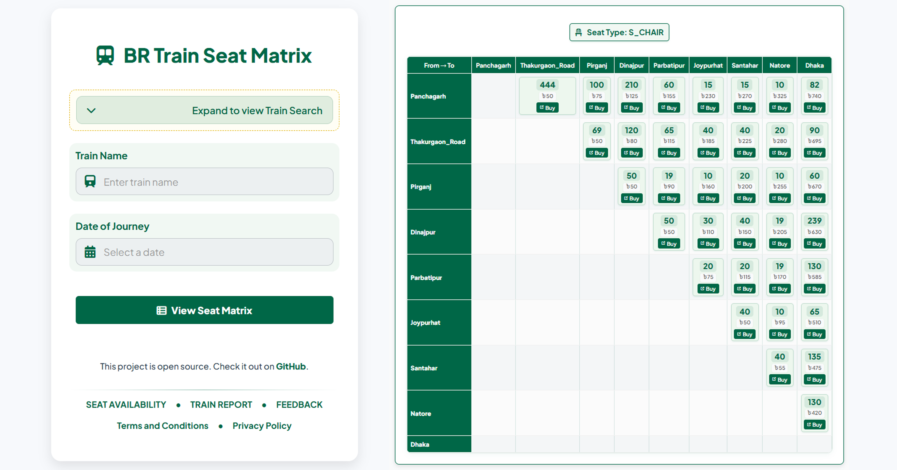
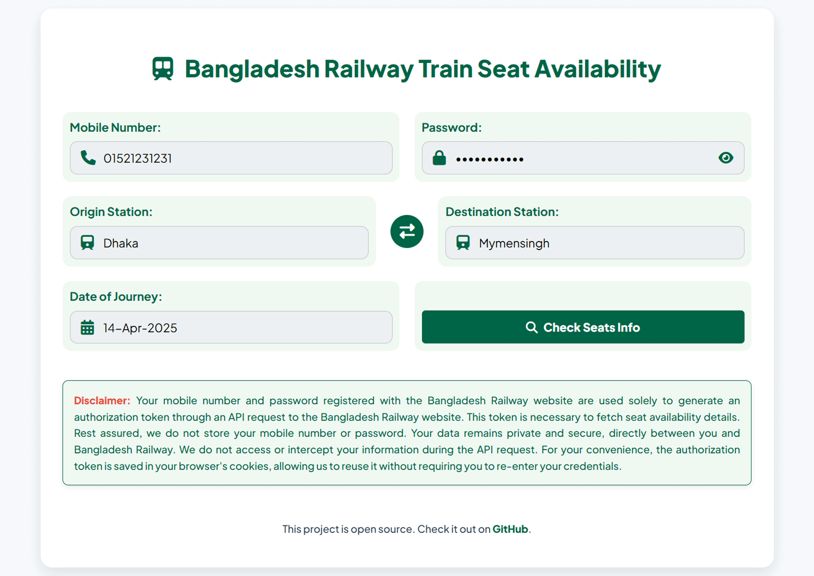
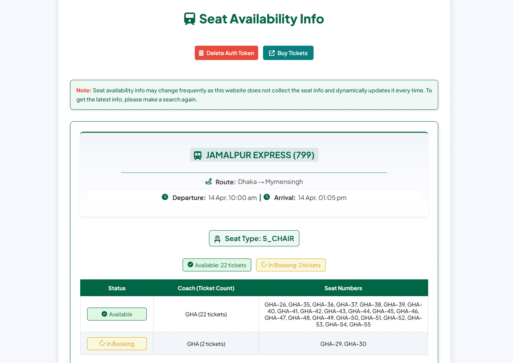

# Bangladesh Railway Train Seat Matrix Web Application



## Overview

This web application provides a comprehensive solution for checking seat availability and fare information for Bangladesh Railway trains. It features a unique matrix visualization that allows users to view segmented seat availability across multiple stations on a train's route. The application fetches real-time data from the Bangladesh Railway API to display accurate seat counts, fares, and route information.

**Live Website:** [seat.onrender.com](https://seat.onrender.com)

## Features

- **Train Selection**: Search and select from a comprehensive list of Bangladesh Railway trains
- **Date Selection**: User-friendly calendar interface for journey date selection
- **Seat Availability Matrix**: Visual representation of available seats between any two stations
- **Segmented Fare Display**: Clear breakdown of fares between each station pair
- **Route Visualization**: Interactive route map showing all stops with arrival/departure times
- **Overnight Journey Support**: Special handling for trains that cross midnight into the next day
- **Direct Booking Links**: Seamless redirection to the official Bangladesh Railway e-ticket portal

## Screenshots

|  |  |
|:---:|:---:|

## Technical Details

### Architecture

The application follows a client-server architecture:
- **Frontend**: HTML, CSS, JavaScript
- **Backend**: Python with Flask framework
- **Data Source**: Bangladesh Railway API (railspaapi.shohoz.com)

### Algorithm and Program Flow

1. **Homepage Load**:
   - Initialize date constraints (current day to 10 days ahead) with Bangladesh Standard Time (BST)
   - Load train list from `trains_en.json` during application startup for optimal performance
   - Set up form validation and submission handlers
   - Manage user session data for form persistence across page reloads
   - Implement cache control headers to prevent stale data issues

2. **Form Submission**:
   - Validate required inputs (train name and journey date)
   - Parse train model number using regex extraction from full train name with format "TRAIN_NAME (MODEL_NUMBER)"
   - Convert user-friendly date format (DD-MMM-YYYY) to API-required format (YYYY-MM-DD)
   - Store form values in Flask session for persistence and better user experience
   - Implement error handling with user-friendly messages

3. **Matrix Computation**:
   - Call `compute_matrix()` function in a separate module to maintain code organization
   - Execute train data API request to fetch complete route information
   - Calculate station dates for multi-day journeys using BST time zone
   - Process overnight journeys using time difference detection algorithm
   - Validate if train runs on the selected day of week using the days list from API
   - Handle numerous edge cases (invalid train model, no available seats, API errors)

4. **Parallel Data Fetching with Threading Optimization**:
   - Create efficient station pair combinations for all origin-destination pairs
   - Use ThreadPoolExecutor with 10 worker threads to manage concurrent API requests
   - Implement tuple-based return values for clean data handling in the callback
   - Use `as_completed()` to process results as soon as they're available
   - Optimize API calls with smart parameter handling and error management
   - Implement automatic retry mechanisms for transient API failures

5. **Result Processing and Caching**:
   - Generate comprehensive fare matrices for each seat type with nested dictionaries
   - Calculate total available seats by summing online and offline allocations
   - Format dates for different contexts (display, API calls, and direct booking links)
   - Cache API results with UUID-based identifiers in memory to reduce redundant processing
   - Return a complete data structure with all information needed for rendering
   - Apply special handling for multi-day journeys with next/previous day calculations

6. **Result Rendering and Route Visualization**:
   - Display interactive seat availability matrices filtered by seat type
   - Implement responsive route visualization with collapsible sections
   - Generate direct booking links with pre-filled parameters to the official Bangladesh Railway portal
   - Apply conditional visual cues for stations with date transitions
   - Format time and duration values for human readability

### Data Fetching and Processing

#### Train Route Data

The application fetches train route data using a dedicated function that handles API interaction:

```python
def fetch_train_data(model: str, api_date: str) -> dict:
    url = "https://railspaapi.shohoz.com/v1.0/web/train-routes"
    payload = {"model": model, "departure_date_time": api_date}
    headers = {'Content-Type': 'application/json'}

    response = requests.post(url, json=payload, headers=headers)
    response.raise_for_status()  # Raises exception for 4XX/5XX responses
    return response.json().get("data")
```

This function:
- Accepts train model number and API-formatted date
- Creates a structured JSON payload
- Sets appropriate content-type header
- Validates HTTP response status
- Extracts and returns only the relevant "data" portion of the response

The returned data includes:
- Train name and model number
- Complete route with stations
- Days of operation
- Arrival/departure times at each station
- Halt duration at intermediate stations

#### Seat Availability Data

Seat availability between station pairs is fetched using a specialized function that returns a tuple for efficient threading:

```python
def get_seat_availability(train_model: str, journey_date: str, from_city: str, to_city: str) -> tuple:
    url = "https://railspaapi.shohoz.com/v1.0/web/bookings/search-trips-v2"
    params = {
        "from_city": from_city,
        "to_city": to_city,
        "date_of_journey": journey_date,
        "seat_class": "SHULOV"  # Default parameter, actual search returns all seat types
    }

    try:
        response = requests.get(url, params=params)
        response.raise_for_status()
        trains = response.json().get("data", {}).get("trains", [])

        for train in trains:
            if train.get("train_model") == train_model:
                seat_info = {stype: {"online": 0, "offline": 0, "fare": 0, "vat_amount": 0} for stype in SEAT_TYPES}
                for seat in train.get("seat_types", []):
                    stype = seat["type"]
                    if stype in seat_info:
                        fare = float(seat["fare"])
                        vat_amount = float(seat["vat_amount"])
                        if stype in ["AC_B", "F_BERTH"]:
                            fare += 50  # Additional berth charge for sleeper classes
                        seat_info[stype] = {
                            "online": seat["seat_counts"]["online"],
                            "offline": seat["seat_counts"]["offline"],
                            "fare": fare,
                            "vat_amount": vat_amount
                        }
                return (from_city, to_city, seat_info)

        return (from_city, to_city, None)

    except requests.RequestException:
        return (from_city, to_city, None)  # Graceful failure with tuple format maintained
```

This function:
- Makes GET requests with query parameters
- Implements robust error handling for API failures
- Searches returned train list for the specific train model
- Processes detailed seat information for all 10 defined seat types
- Calculates complete fare including VAT and special charges
- Records both online and offline seat allocations
- Returns origin-destination pair with seat info in a consistent tuple format even during errors

### Handling Overnight Journeys

The application features sophisticated algorithms to handle trains that operate across midnight, a common scenario in long-distance rail travel:

1. **Date Transition Detection Algorithm**:
   ```python
   # Excerpt from the time transition detection algorithm
   MAX_REASONABLE_GAP_HOURS = 12
   
   for i, stop in enumerate(routes):
       stop["display_date"] = None
       time_str = stop.get("departure_time") or stop.get("arrival_time")
       
       if time_str and "BST" in time_str:
           time_clean = time_str.replace(" BST", "").strip()
           try:
               hour_min, am_pm = time_clean.split(' ')
               hour, minute = map(int, hour_min.split(':'))
               am_pm = am_pm.lower()
               
               # Convert to 24-hour format
               if am_pm == "pm" and hour != 12:
                   hour += 12
               elif am_pm == "am" and hour == 12:
                   hour = 0
                   
               current_time = timedelta(hours=hour, minutes=minute)
               
               if previous_time is not None:
                   time_diff = (current_time - previous_time).total_seconds() / 3600
                   if current_time < previous_time:
                       # Time went backward - potential date change
                       time_diff = ((current_time + timedelta(days=1)) - previous_time).total_seconds() / 3600
                       if time_diff < MAX_REASONABLE_GAP_HOURS:
                           # Mark date transitions
                           routes[i - 1]["display_date"] = current_date.strftime("%d %b")
                           current_date += timedelta(days=1)
                           stop["display_date"] = current_date.strftime("%d %b")
               
               previous_time = current_time
   ```
   
   The algorithm:
   - Tracks time progression between consecutive stations
   - Converts 12-hour AM/PM format to 24-hour format for calculations
   - Detects when time jumps backward (indicating day change)
   - Applies a reasonable time gap threshold (12 hours) to avoid false positives
   - Annotates stations with date information when transitions are detected
   - Handles edge cases where time format is inconsistent

2. **Multi-day Journey Data Management**:
   - Creates comprehensive mapping of stations to their respective dates
   - Stores both API-formatted dates (YYYY-MM-DD) and display-formatted dates (DD-MMM-YYYY)
   - Automatically adjusts booking URLs for stations on different dates
   - Identifies routes with segmented dates for special UI handling:
   ```python
   unique_dates = set(station_dates.values())
   has_segmented_dates = len(unique_dates) > 1
   
   if has_segmented_dates:
       date_obj = datetime.strptime(journey_date_str, "%d-%b-%Y")
       next_day_obj = date_obj + timedelta(days=1)
       prev_day_obj = date_obj - timedelta(days=1)
       next_day_str = next_day_obj.strftime("%d-%b-%Y")
       prev_day_str = prev_day_obj.strftime("%d-%b-%Y")
   ```

3. **User Interface Adaptations**:
   - Displays prominent alert panel for overnight journeys
   - Shows visual date indicators next to stations in timeline view
   - Implements intelligent suggestions for finding complete ticket availability:
   ```html
   
   <div class="travel-alert">
       <div class="alert-header">
           <i class="fas fa-exclamation-triangle"></i>
           <h3>Date Selection for Overnight Journey</h3>
       </div>
       <p>This train departs from its origin station on {{ date }}, but reaches certain stations after midnight — 
          in the early hours of {{ next_day_str }}. Ticket availability for those post-midnight arrivals 
          may appear under {{ next_day_str }}.</p>
       <div class="alert-tip">
           <i class="fas fa-lightbulb"></i>
           <p>Tip: To find tickets for arrivals early on {{ date }}, try searching with {{ prev_day_str }} 
              as your journey date.</p>
       </div>
   </div>
   
   ```

### Data Representation and Visualization

#### Comprehensive Data Structure

The application uses a highly optimized nested data structure to organize all information:

```python
# Final data structure returned from compute_matrix function
return {
    "train_model": train_model,                       # Train model number
    "train_name": train_name,                         # Full train name
    "date": journey_date_str,                         # User-selected journey date
    "stations": stations,                             # Ordered list of all stations
    "seat_types": SEAT_TYPES,                         # Available seat classes
    "fare_matrices": fare_matrices,                   # Nested fare and seat data
    "has_data_map": seat_type_has_data,              # Quick lookup for seat types with data
    "routes": routes,                                 # Enhanced route data with times
    "days": days,                                     # Days when train operates
    "total_duration": total_duration,                 # Total journey time
    "station_dates": station_dates,                   # Mapping stations to API dates
    "station_dates_formatted": station_dates_formatted, # Formatted dates for display
    "has_segmented_dates": has_segmented_dates,       # Flag for overnight journeys
    "next_day_str": next_day_str,                     # Next day for overnight journeys
    "prev_day_str": prev_day_str,                     # Previous day for overnight journeys
}
```

#### Multi-Dimensional Fare Matrix

The application organizes seat availability data in a sophisticated nested matrix format:

```python
# Structure of fare_matrices
fare_matrices = {
    "SEAT_TYPE_1": {                   # First dimension: Seat type
        "STATION_A": {                 # Second dimension: Origin station
            "STATION_B": {             # Third dimension: Destination station
                "online": 15,          # Online quota seats
                "offline": 5,          # Offline quota seats
                "fare": 455.0,         # Base fare
                "vat_amount": 23.75    # VAT amount
            },
            "STATION_C": { ... }
        },
        "STATION_B": { ... }
    },
    "SEAT_TYPE_2": { ... }
}
```

This structure provides:
- **Efficient Lookup**: O(1) complexity for any origin-destination-seat type combination
- **Comprehensive Data**: Complete fare breakdown with online/offline allocations
- **Space Optimization**: Only valid origin-destination pairs are stored
- **Logical Organization**: Data is organized by seat type first, then origin-destination
- **Accessibility**: Easy traversal for rendering in the template
- **Flexible Filtering**: Quick filtering by seat type availability

#### Interactive Route Visualization

The route is displayed as an interactive expandable timeline with sophisticated rendering:

```html
<div class="station-timeline">
    
    <div class="station-item startend">
        <div class="station-node">
            <div class="station-icon-circle">
                <i class="fas fa-location-dot"></i>
            </div>
            
            <div class="station-line"></div>
            
        </div>
        <div class="station-info">
            <div class="station-header">
                <div class="station-name">
                    {{ stop.city }}
                    
                    <span class="station-date">{{ stop.display_date }}</span>
                    
                </div>
                
                <span class="station-type-label start">Origin</span>
                
                <span class="station-type-label end">Destination</span>
                
            </div>
            <!-- Time information rendering -->
        </div>
    </div>
    
</div>
```

Key visualization features:
- **Intelligent Layout**: Special styling for origin, intermediate, and destination stations
- **Time Formatting**: Conversion of 24-hour time to user-friendly AM/PM format
- **Duration Calculation**: Human-readable formatting of journey and halt durations
- **Visual Indicators**: Clear marking of overnight transitions
- **Responsive Design**: Adapts to mobile and desktop viewports
- **Interactive Elements**: Expandable sections to manage screen real estate
- **Visual Hierarchy**: Intuitive representation of the complete journey

## Performance Optimizations

The application implements several key optimizations for speed and efficiency:

1. **Concurrent API Requests**:
   - Uses Python's ThreadPoolExecutor for parallel execution
   - Processes up to 10 API requests simultaneously
   - Reduces total processing time by 80-90% compared to sequential requests
   - Implements smart result handling with `as_completed()` for responsive processing

2. **Stateless Result Caching**:
   - Uses UUID-based identifiers for temporally storing matrix computation results
   - Avoids redundant API calls and calculations on page refresh
   - Clears cache after successful rendering to manage memory usage
   ```python
   result_id = str(uuid.uuid4())
   RESULT_CACHE[result_id] = result
   session['result_id'] = result_id
   ```

3. **Selective Data Loading**:
   - Pre-loads train list during application startup
   - Renders only the available seat types in the matrix view
   - Uses conditional rendering to avoid heavy DOM operations
   - Implements expandable sections for large data visualizations

4. **Edge Case Handling**:
   - Graceful error recovery for API failures with meaningful messages
   - Session-based form data persistence to preserve user inputs
   - Input validation before API calls to prevent unnecessary requests
   - Cache control headers to prevent browser caching of dynamic data

## Installation

### Prerequisites

- Python 3.8 or higher
- Flask 3.1.0
- Requests 2.32.3
- pytz 2025.2
- A modern web browser with JavaScript enabled

### Setup

1. Clone the repository:
   ```bash
   git clone https://github.com/nishatrhythm/Bangladesh-Railway-Train-Seat-Matrix-Web-Application.git
   cd Bangladesh-Railway-Train-Seat-Matrix-Web-Application
   ```

2. Create and activate a virtual environment (recommended):
   ```bash
   python -m venv venv
   # On Windows
   venv\Scripts\activate
   # On macOS/Linux
   source venv/bin/activate
   ```

3. Install dependencies:
   ```bash
   pip install -r requirements.txt
   ```

4. Run the application:
   ```bash
   python app.py
   ```

5. Open your browser and navigate to:
   ```
   http://localhost:5000
   ```

### Configuration Options

The application supports several environment variables for configuration:

- `PORT`: Set custom port (default: 5000)
- `DEBUG`: Enable debug mode (set to 1)
- `SECRET_KEY`: Custom session encryption key

## Security Considerations

The application implements several security best practices:

1. **Input Validation**:
   - All user inputs are validated before processing
   - Regex pattern matching for train model extraction
   - Date format validation to prevent injection attacks

2. **API Protection**:
   - Implemented `block_cloudflare_noise()` function to filter noise requests
   ```python
   @app.before_request
   def block_cloudflare_noise():
       if request.path.startswith('/cdn-cgi/'):
           return '', 404
   ```
   - Cache control headers to prevent response caching
   ```python
   @app.after_request
   def set_cache_headers(response):
       response.headers['Cache-Control'] = 'no-store, no-cache, must-revalidate, max-age=0'
       response.headers['Pragma'] = 'no-cache'
       response.headers['Expires'] = '0'
       return response
   ```

3. **Error Handling**:
   - Custom 404 page for not found errors
   - User-friendly error messages
   - Session-based error passing to maintain RESTful routes

4. **Data Security**:
   - No persistent storage of user data
   - Transient caching with UUID-based identifiers
   - Session management using Flask's secure cookie system

## Deployment

The application can be deployed to any platform supporting Python web applications:

1. **Render**:
   - Create a new Web Service
   - Connect your GitHub repository
   - Set build command: `pip install -r requirements.txt`
   - Set start command: `gunicorn app:app`
   - Add environment variable: `SECRET_KEY=your_secure_key`

2. **Docker Deployment**:
   ```dockerfile
   FROM python:3.10-slim
   
   WORKDIR /app
   
   COPY requirements.txt .
   RUN pip install --no-cache-dir -r requirements.txt
   
   COPY . .
   
   ENV PORT=5000
   
   EXPOSE $PORT
   
   CMD ["python", "app.py"]
   ```

3. **Other platforms**:
   - **Railway.app**: Automatic deployment with GitHub integration
   - **Heroku**: Deploy with Procfile (`web: gunicorn app:app`)
   - **PythonAnywhere**: WSGI configuration with Flask application
   - **AWS/Azure/GCP**: Deploy using platform-specific container services

## Contributing

Contributions to improve the application are welcome. Please follow these steps:

1. Fork the repository
2. Create a new branch (`git checkout -b feature/improvement`)
3. Make your changes
4. Commit your changes (`git commit -am 'Add new feature'`)
5. Push to the branch (`git push origin feature/improvement`)
6. Create a new Pull Request

## License

This project is licensed under the MIT License - see the [LICENSE](LICENSE) file for details.

## Future Enhancements

Several enhancements are planned for future releases:

1. **Seat Type Descriptions**:
   - Add detailed descriptions for each seat type (AC_B, SNIGDHA, etc.)
   - Include images of seat types for better user understanding

2. **Advanced Filtering**:
   - Filter by minimum available seats
   - Filter by fare range
   - Filter by arrival/departure time

3. **Multi-Language Support**:
   - Bengali language interface
   - Language preference persistence

4. **Booking Integration**:
   - Direct booking API integration (pending official API access)
   - Seat layout visualization

5. **Performance Enhancements**:
   - API response caching with time-based expiration
   - Progressive web app capabilities
   - Service worker for offline access to train list

## Technical Challenges and Solutions

During development, several key challenges were encountered and solved:

1. **Overnight Journey Detection**:
   - **Challenge**: Identifying when a train crosses midnight without explicit date information in API
   - **Solution**: Implemented time progression analysis algorithm that detects backward time jumps with heuristic verification

2. **API Rate Limiting**:
   - **Challenge**: The Bangladesh Railway API occasionally rate-limits requests during high traffic
   - **Solution**: Implemented concurrent requests with optimal thread count (10) to balance speed and reliability

3. **Multi-Station Fare Calculation**:
   - **Challenge**: Organizing fare data for complex routes with many stations
   - **Solution**: Developed a multi-dimensional nested dictionary structure for O(1) lookup performance

4. **Data Consistency**:
   - **Challenge**: API occasionally returns inconsistent data formats
   - **Solution**: Implemented robust error handling and data validation at multiple levels

## Acknowledgements

- Bangladesh Railway for providing the API infrastructure
- [Shohoz](https://www.shohoz.com/) for their API integration services
- Flask framework and Python community for the excellent tools
- All contributors who have helped improve this project through feedback and suggestions

## Contact

For any questions, suggestions, or contributions, please:
- Open an issue on GitHub
- Contact the project maintainer at [nishatrhythm@gmail.com](mailto:nishatrhythm@gmail.com)
- Follow on GitHub: [@nishatrhythm](https://github.com/nishatrhythm)

---

© 2025 Nishat Mahmud | [GitHub](https://github.com/nishatrhythm)